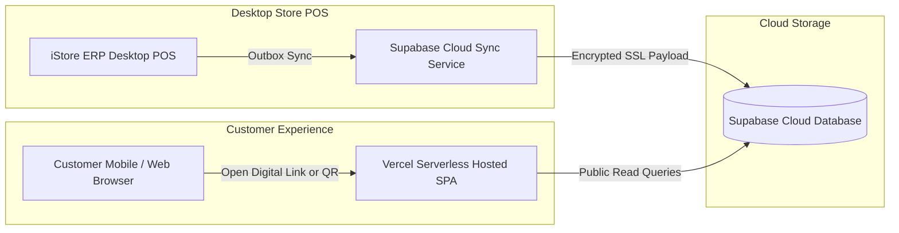

# iStore Public Customer Portal

[](https://reactjs.org)
[](https://www.typescriptlang.org/)
[](https://vitejs.dev)
[](https://tailwindcss.com)
[](https://supabase.com)
[](https://github.com/SahanPramuditha-Dev/I-Store-Customer-Portal/actions/workflows/ci.yml)
[](LICENSE)

A mobile-first, high-performance customer-facing web portal for **iStore ERP**. Enables customers to track live device repair status in real-time, view verified digital tax invoices, download PDF receipts, and validate product warranties on any smartphone or browser.

---

## 🌟 Key Features

* 🛠️ **Live Repair Ticket Tracking**: Real-time progress timeline (*Received → Diagnostics → In Progress → Ready for Pickup → Delivered*) with technician notes and estimated costs.
* 🧾 **Verified Digital Invoices**: Instant access to itemized tax invoices with subtotal, tax breakdown, payment method, and warranty terms.
* 📄 **Client-Side PDF Generation**: One-click instant high-resolution PDF receipt export via `html2pdf.js`.
* 📱 **QR Code Sharing**: Dynamic QR codes embedded on receipts for quick customer sharing and counter verification.
* 🏪 **Multi-Store & Branch Branding**: Dynamic branch profile detection (`?store=your-branch-id`) loading custom logos, store headers, contact numbers, and address details from Supabase.
* 🔒 **Secure Data Access**: Phone-number verification and tokenized lookup prevents unauthorized access to customer records.

---

## 🏗️ Architecture & Data Flow



---

## ⚡ Quickstart & Local Development

### Prerequisites
* **Node.js** (v18 or higher)
* **npm**

### Installation

```bash
# 1. Clone repository
git clone https://github.com/SahanPramuditha-Dev/I-Store-Customer-Portal.git
cd I-Store-Customer-Portal

# 2. Copy environment template
cp .env.example .env

# 3. Configure Supabase credentials in .env
# VITE_SUPABASE_URL=https://your-project.supabase.co
# VITE_SUPABASE_ANON_KEY=your-anon-key

# 4. Install dependencies
npm install

# 5. Start development server
npm run dev
```

The portal will be live at: [http://localhost:5173](http://localhost:5173)

---

## 🚀 Production Deployment (Vercel)

1. Import the repository into [Vercel](https://vercel.com).
2. Set Framework Preset to **Vite**.
3. Configure Environment Variables:
   * `VITE_SUPABASE_URL`: Your Supabase Project URL.
   * `VITE_SUPABASE_ANON_KEY`: Your Supabase Public Anonymous Key.
4. Deploy! SPA client routing is handled automatically via `vercel.json`.

---

## 🗄️ Database Schema & Setup

The portal relies on the Supabase schema provided in [`supabase_schema.sql`](supabase_schema.sql):
* `repair_tickets`: Live repair stages, diagnostic notes, costs, and customer phone index.
* `invoices`: Digital invoice summaries, items JSON, payments, and verification tokens.
* `store_profiles`: Branch names, logos, phone numbers, and addresses for dynamic branding.

---

## 🤝 Contributing

Please read our [Contributing Guidelines](CONTRIBUTING.md) and [Changelog](CHANGELOG.md) before submitting pull requests.

---

## 📄 License

Distributed under the MIT License. See [LICENSE](LICENSE) for details.
